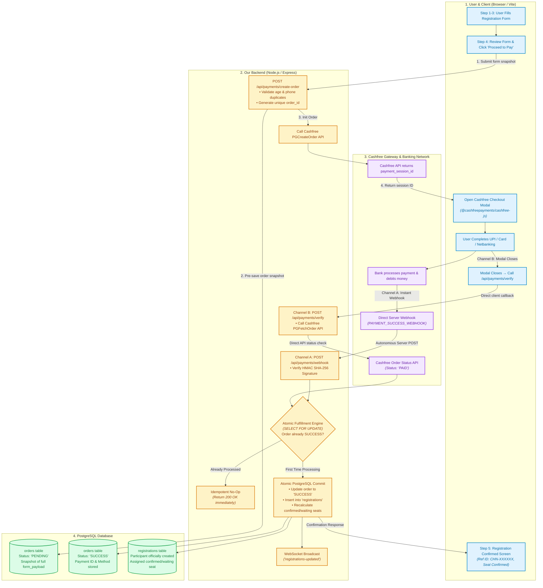
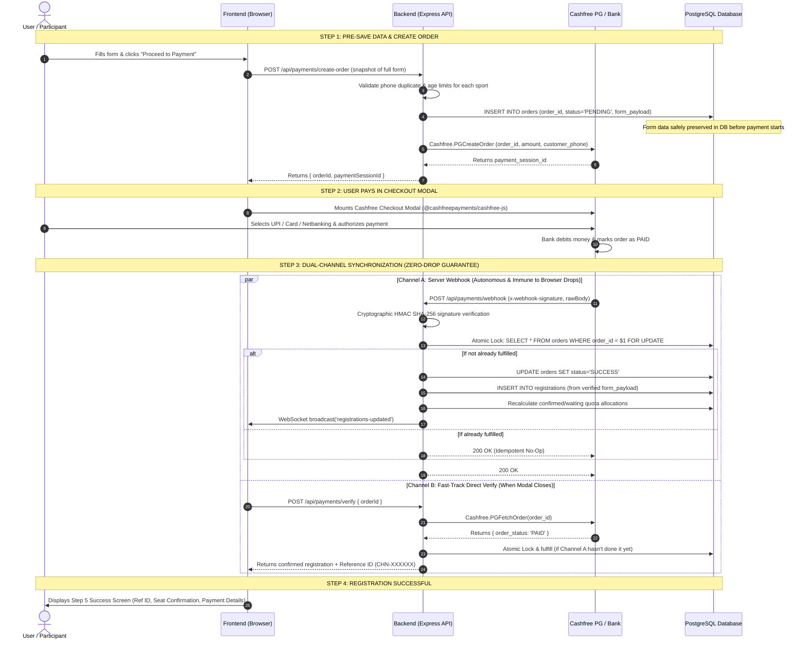

# Cashfree Payment Gateway — Zero-Failure Architecture

This document defines the payment architecture for the **CHANSMA Olympic Registration** platform.

---

## 1. High-Level System Architecture & Component Flow



---

## 2. Chronological Sequence Diagram (Step-by-Step)



---

## 3. How Zero-Failure & Zero-Lost-Payment Is Guaranteed

| Failure Scenario | What Happens In Standard Integrations | How Our Architecture Prevents It |
|---|---|---|
| **User closes browser right after paying** | Registration is lost; user's money is debited with no receipt. | **Pre-Saved Order + Webhook**: Form data was already saved in PostgreSQL as `PENDING`. Cashfree's server webhook communicates directly to our backend server, autonomously committing the registration even if the browser is closed. |
| **Cashfree Webhook is delayed** | User sits on a blank loading screen or sees a false timeout. | **Channel B (Direct API Fetch)**: When the modal closes, our backend actively queries Cashfree's `PGFetchOrder` API and instantly confirms the registration without waiting for the webhook. |
| **Both Webhook & Frontend Verify fire at the same time** | Duplicate registration created; tournament seats double-counted. | **PostgreSQL Row Lock (`SELECT FOR UPDATE`) & Idempotency Guard**: Whichever channel executes first marks the order `SUCCESS`. The second channel sees `SUCCESS` and exits cleanly as a safe no-op. |
| **Client-side tampering** | Attacker calls `/api/registrations` directly or fakes success. | **Zero-Trust Client**: Registrations can **only** be created by the backend fulfillment engine after cryptographic HMAC SHA-256 signature verification or Cashfree official REST API verification. |
| **Payment cancelled or declined by bank** | Partial data remains or seats get blocked. | The order is marked `FAILED` / `USER_DROPPED`. **No registration is inserted**, and no tournament seats are consumed. The user stays on Step 4 (Review) with all their inputs preserved so they can retry. |

---

## 4. Database Schema Structure

### `orders` Table
```sql
CREATE TABLE IF NOT EXISTS orders (
  order_id TEXT PRIMARY KEY,               -- e.g. order_CHN_K89X2P
  registration_id TEXT NOT NULL,          -- e.g. CHN-K89X2P
  customer_name TEXT NOT NULL,
  customer_mobile TEXT NOT NULL,
  amount NUMERIC(10, 2) NOT NULL,
  status TEXT NOT NULL DEFAULT 'PENDING',  -- PENDING, SUCCESS, FAILED, USER_DROPPED
  form_payload JSONB NOT NULL,            -- Complete snapshot of user's form inputs
  cf_order_id TEXT,
  cf_payment_id TEXT,
  payment_method TEXT,                    -- UPI, Card, Netbanking
  created_at TIMESTAMPTZ NOT NULL DEFAULT NOW(),
  updated_at TIMESTAMPTZ NOT NULL DEFAULT NOW()
);

CREATE INDEX IF NOT EXISTS idx_orders_status ON orders (status);
CREATE INDEX IF NOT EXISTS idx_orders_mobile ON orders (customer_mobile);
```

### `registrations` Table Enhancements
```sql
ALTER TABLE registrations ADD COLUMN IF NOT EXISTS order_id TEXT;
ALTER TABLE registrations ADD COLUMN IF NOT EXISTS payment_id TEXT;
ALTER TABLE registrations ADD COLUMN IF NOT EXISTS payment_status TEXT DEFAULT 'PAID';
ALTER TABLE registrations ADD COLUMN IF NOT EXISTS amount_paid NUMERIC(10, 2);
```
